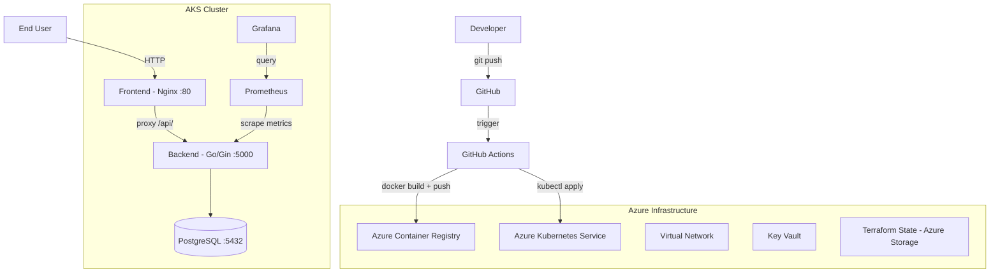

# CloudOps Platform

[](https://github.com/[USERNAME]/cloudops/actions/workflows/backend-pipeline.yml)
[](https://github.com/[USERNAME]/cloudops/actions/workflows/frontend-pipeline.yml)
[](https://github.com/[USERNAME]/cloudops/actions/workflows/infrastructure-pipeline.yml)

A production-grade DevOps automation platform deployed on Azure Kubernetes Service (AKS), demonstrating end-to-end infrastructure provisioning, CI/CD automation, and observability.

## Architecture



## Tech Stack

| Layer          | Technology               | Version               |
| -------------- | ------------------------ | --------------------- |
| Cloud          | Microsoft Azure          | -                     |
| Infrastructure | Terraform                | 1.9                   |
| Orchestration  | Kubernetes (AKS)         | 1.33                  |
| CI/CD          | GitHub Actions           | -                     |
| Backend        | Go + Gin                 | 1.25                  |
| Database       | PostgreSQL               | 18                    |
| Frontend       | HTML + Nginx             | Alpine                |
| Monitoring     | Prometheus + Grafana     | kube-prometheus-stack |
| Registry       | Azure Container Registry | Basic                 |

## Project Structure

```bash
cloudops-platform/
├── .github/workflows/       # CI/CD pipelines
│   ├── backend-pipeline.yml
│   ├── frontend-pipeline.yml
│   └── infrastructure-pipeline.yml
├── applications/
│   ├── backend/             # Go/Gin REST API
│   ├── frontend/            # HTML + Nginx
│   └── docker-compose.yml   # Local development
├── kubernetes/base/         # Kubernetes manifests
│   ├── backend/
│   ├── frontend/
│   └── database/
├── terraform/               # Infrastructure as Code
│   ├── environments/dev/
│   └── modules/
├── monitoring/
│   └── alerting/rules.yml   # Alerting rules
├── scripts/                 # Operational scripts
│   ├── deploy.sh
│   ├── rollback.sh
│   └── backup.sh
└── docs/                    # Architecture & runbooks
```

## Quick Start (Local Development)

**Prerequisites:** Docker, Docker Compose

```bash
# Clone the repository
git clone https://github.com/[USERNAME]/cloudops.git
cd cloudops-platform

# Start all services
cd applications
docker-compose up --build

# Access the app
# Frontend: http://localhost
# Backend API: http://localhost/api/tasks
```

## Infrastructure Setup

**Prerequisites:** Terraform >= 1.9, Azure CLI, kubectl

```bash
# 1. Login to Azure
az login

# 2. Configure Terraform variables
cd terraform/environments/dev
cp terraform.tfvars.example terraform.tfvars
# Fill in your values: subscription_id, resource_group_name, key_vault_name

# 3. Provision infrastructure
terraform init
terraform apply

# 4. Deploy applications
bash scripts/deploy.sh
```

## CI/CD Pipeline

Every push to `main` automatically triggers the relevant pipeline:

| Change                     | Pipeline       | Steps                                              |
| -------------------------- | -------------- | -------------------------------------------------- |
| `applications/backend/**`  | Backend CI/CD  | go build → docker build → push ACR → kubectl apply |
| `applications/frontend/**` | Frontend CI/CD | docker build → push ACR → kubectl apply            |
| `terraform/**`             | Infrastructure | fmt check → validate → plan                        |

## API Reference

| Method | Endpoint         | Description    |
| ------ | ---------------- | -------------- |
| GET    | `/api/`          | Health check   |
| GET    | `/api/tasks`     | List all tasks |
| POST   | `/api/tasks`     | Create a task  |
| GET    | `/api/tasks/:id` | Get task by ID |
| PUT    | `/api/tasks/:id` | Update task    |
| DELETE | `/api/tasks/:id` | Delete task    |
| GET    | `/api/users`     | List all users |
| POST   | `/api/users`     | Create a user  |

## Monitoring

```bash
# Access Grafana dashboard (local port-forward)
kubectl port-forward -n monitoring svc/monitoring-grafana 3000:80

# Open: http://localhost:3000
# Username: admin
# Password: admin123

# Available dashboards:
# Kubernetes / Compute Resources / Cluster
# Kubernetes / Compute Resources / Pod
# Kubernetes / Nodes
```

## Operational Runbooks

- [Deployment Guide](docs/runbooks/deployment.md)
- [Rollback Guide](docs/runbooks/rollback.md)
- [Troubleshooting Guide](docs/runbooks/troubleshooting.md)
